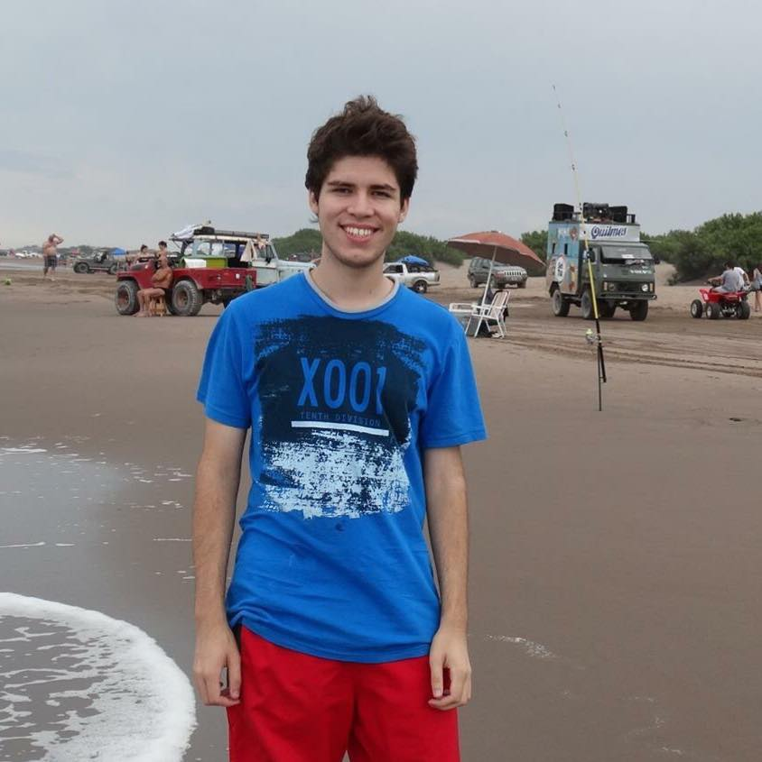

### Leandro Ariel Di Pietro
¡Hola! Me llamo Leandro, tengo 24 años y vivo en Castelar. Este es mi tercer cuatrimestre en la universidad. Estoy cursando programación con objetos I, bases de datos e inglés II. 

Me gusta ver series y películas, leer y jugar videojuegos.

Cuando terminé la secundaria comencé a trabajar en atención al cliente durante un tiempo. Después de eso, ingresé a la UNLaM para estudiar la carrera de Licenciatura en Kinesiología y Fisiatría.

A lo largo de la pandemia, no pude cursar algunas materias a distancia por ser prácticas, lo cual retrasó el plan de estudios. Por lo tanto, en 2021, durante la cursada de materias de tercer año, tomé la decisión de abandonar Kinesiología. 

Durante el 2022, comencé a investigar sobre otra carrera que, si bien me gustaba, nunca me había planteado seriamente. De esta manera, elegí estudiar la Licenciatura en Informática. Si bien la UNLaM dispone de esa carrera, preferí anotarme nuevamente en la UNAHUR debido a sus novedosas tecnicaturas y su cercanía.

Fue así como en marzo del 2022 me anoté a la Tecnicatura Universitaria en Programación y comencé a cursar el CPU en junio.

En un futuro, espero poder capacitarme como profesional y en el corto plazo poder conseguir trabajo en relación con lo que estudio.

Les dejo una imagen mía:

